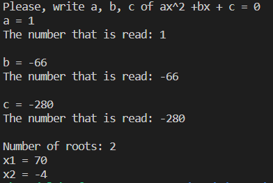

# Квадратка

_(Программа для решения квадратных уравнений)_

---

## Как работает

После запуска программы, она предложит вам ввести 3 числа: коэффициенты уравнения вида ax^2 + bx + c = 0. После ввода каждого из чисел программа выведет, что ей удалось считать.
После ввода всех коэффициентов программа выведет количество корней, а также сами корни (если имеются).
Точность подсчётов - 0.01 (т.е. до 2-го знака).

---

## Как установить

1. `git clone https://github.com/WhiteDolphinn/kvadratka.git`

2. `make run`

---
